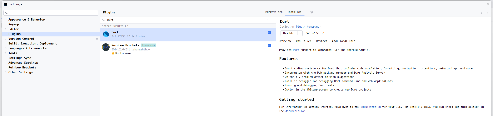
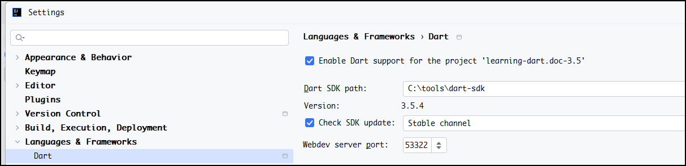

# learning-dart.doc-3.5

## 如何安装 dart SDK

### 1. 下载 SDK 的压缩包

[https://dart.dev/get-dart/archive](https://dart.dev/get-dart/archive)

### 2. 解压到合适的目录

### 3. IDE 安装 Dart 插件

### 4. IDE 中指定 SDK 所在的目录

